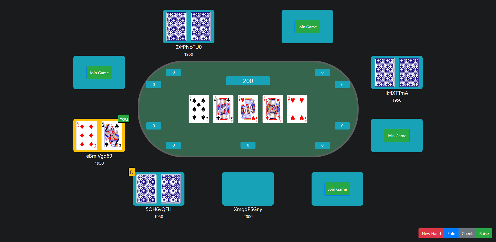

# OpenPoker


OpenPoker is an open source online poker platform focused on providing a simple user interface along with a comprehensive API.



### Usage

Clone the repo
```sh
git clone https://github.com/MegaLLC/OpenPoker.git
```

Install and run the backend:
```sh
npm install
npm run dev
```


Install and run the front end:
```sh
npm install
npm start
```

### License

Distributed under the MIT License. See LICENSE for more information.

